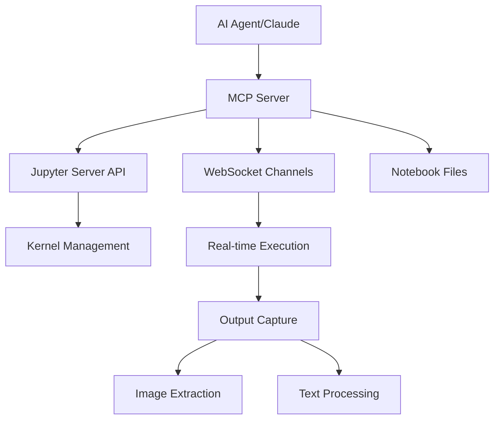

<!--
  ~ Originally developed by Datalayer, Inc.
  ~ Forked and enhanced by Joseph Lin
  ~
  ~ BSD 3-Clause License
-->

# 🚀 Jupyter MCP Server

[](https://python.org)
[](LICENSE)
[](https://modelcontextprotocol.io)
[](https://github.com/psf/black)

> **A comprehensive Model Context Protocol (MCP) server that bridges AI agents with Jupyter notebooks, enabling real-time code execution, visualization generation, and advanced image extraction capabilities.**

## 🎯 **About This Project**

This project is a fork and enhancement of the original Jupyter MCP Server developed by [Datalayer, Inc.](https://github.com/datalayer/jupyter-mcp-server). Special thanks to the Datalayer team for their foundational work on integrating Jupyter with the Model Context Protocol ecosystem.

**Key Enhancements in This Fork:**
- Improved documentation and setup process
- Enhanced error handling and robustness
- Additional example configurations
- Streamlined installation and configuration
- Updated dependencies and compatibility

## 🌟 **Key Features**

### 🎯 **Real-Time Jupyter Integration**
- **Live Code Execution**: Execute Python code in real-time through WebSocket connections
- **Kernel Management**: Automatic kernel creation, lifecycle management, and cleanup
- **Session Persistence**: Maintain state across multiple operations

### 🖼️ **Advanced Image Extraction** 
- **Multi-Format Support**: Extract PNG and JPEG images from matplotlib, seaborn, plotly
- **Base64 Encoding**: Ready-to-use image data for AI processing
- **Comprehensive Output Handling**: Text, images, errors, and execution results

### 📚 **Complete Notebook Management**
- **File Operations**: Create, delete, switch between multiple notebooks
- **Cell Manipulation**: Add, modify, move, delete cells with full CRUD operations
- **Content Management**: Support for both markdown and code cells

### 🛡️ **Enterprise-Ready Security**
- **Smart XSRF Handling**: Automatic token detection and management
- **Authentication Support**: Compatible with tokenized Jupyter servers
- **Error Recovery**: Graceful fallbacks for connection issues

## 🏗️ **Architecture**



## 🛠️ **18 Comprehensive Tools**

### 📝 **Cell Content Management**
- `add_execute_code_cell` - Execute Python code with real-time output
- `add_markdown_cell` - Add formatted documentation
- `modify_cell` - Edit existing cell content
- `change_cell_type` - Convert between markdown and code cells

### 🖼️ **Output Extraction**
- `get_cell_image_output` - Extract base64-encoded images (PNG/JPEG)
- `get_cell_text_output` - Get all text outputs including errors and tracebacks

### 🗂️ **Notebook File Operations**
- `create_notebook` - Create new notebook files
- `delete_notebook` - Remove notebook files safely
- `switch_notebook` - Change active notebook
- `list_notebooks` - Browse available notebooks

### 🔍 **Data Discovery**
- `list_cells` - Overview of all cells with preview
- `read_cell` - Full content of specific cells
- `get_notebook_info` - Comprehensive notebook metadata

[View complete tool documentation →](docs/MCP_TOOLS_SUMMARY.md)

## 🚀 **Quick Start**

### Prerequisites
- Python 3.11+
- Jupyter Notebook
- Claude Desktop or compatible MCP client

### Installation

1. **Clone the repository**
   ```bash
   git clone https://github.com/JosephLin11/jupyter-mcp-server.git
   cd jupyter-mcp-server
   ```

2. **Install dependencies**
   ```bash
   pip install -r requirements.txt
   ```

3. **Start Jupyter Server**
   ```bash
   ./scripts/start_jupyter.sh
   ```

4. **Configure Claude Desktop**
   Add to your `claude_desktop_config.json`:
   ```json
   {
     "mcpServers": {
       "jupyter": {
         "command": "python",
         "args": ["/path/to/your/jupyter-mcp-server/src/jupyter_mcp_server.py"]
       }
     }
   }
   ```
   
   💡 **Tip**: Run `python3 scripts/get_claude_config.py` to generate the correct configuration with current paths!

## 💡 **Example Use Cases**

### 📊 **Data Visualization Pipeline**
```python
# 1. Create and execute visualization code
add_execute_code_cell(cell_content="""
import matplotlib.pyplot as plt
import numpy as np
import seaborn as sns

# Generate sample data
data = np.random.normal(0, 1, 1000)

# Create beautiful visualization
plt.figure(figsize=(12, 8))
plt.subplot(2, 2, 1)
plt.hist(data, bins=50, alpha=0.7, color='skyblue')
plt.title('Distribution Analysis')

plt.subplot(2, 2, 2)
sns.boxplot(y=data)
plt.title('Box Plot Analysis')

plt.tight_layout()
plt.show()
""")

# 2. Extract the generated image
get_cell_image_output(cell_index=0)
```

### 🧪 **Scientific Computing**
```python
# 3D surface visualization
add_execute_code_cell(cell_content="""
from mpl_toolkits.mplot3d import Axes3D
import numpy as np
import matplotlib.pyplot as plt

fig = plt.figure(figsize=(12, 9))
ax = fig.add_subplot(111, projection='3d')

# Create mesh
x = np.linspace(-5, 5, 100)
y = np.linspace(-5, 5, 100)
X, Y = np.meshgrid(x, y)
Z = np.sin(np.sqrt(X**2 + Y**2))

# Render surface
surface = ax.plot_surface(X, Y, Z, cmap='plasma', alpha=0.9)
ax.set_title('3D Mathematical Function')
plt.colorbar(surface)
plt.show()
""")

# Extract 3D visualization
get_cell_image_output(cell_index=1)
```

## 🏆 **Technical Highlights**

### **Advanced WebSocket Implementation**
- Real-time bidirectional communication with Jupyter kernels
- Comprehensive message type handling (execute_result, display_data, stream, error)
- Automatic reconnection and fallback mechanisms

### **Smart Output Processing**
- Multi-format image extraction (PNG, JPEG) with base64 encoding
- Structured output capture preserving metadata
- Error handling with full traceback support

### **Robust Security Model**
- Automatic XSRF token detection and management
- Multiple authentication endpoint support
- Graceful degradation for different Jupyter configurations

### **Enterprise-Grade Error Handling**
- Comprehensive logging with configurable levels
- Fallback execution modes for reliability
- Resource cleanup and connection management

## 📊 **Comparison with Alternatives**

| Feature | This Implementation | jjsantos01 MCP | Cursor MCP |
|---------|---------------------|----------------|------------|
| **Tools Available** | 🏆 **18 tools** | 10 tools | 8-10 tools |
| **Image Extraction** | 🏆 **PNG + JPEG** | PNG only | None |
| **Setup Complexity** | 🏆 **Automatic** | Manual browser init | CLI args |
| **Version Support** | 🏆 **All Jupyter versions** | Jupyter 6.x only | Version agnostic |
| **Real-time Execution** | 🏆 **WebSocket + HTTP** | WebSocket bridge | File-only |
| **Security Handling** | 🏆 **Auto XSRF** | Basic | Enhanced |

## 🧪 **Testing**

Run the comprehensive test suite:

```bash
# Test image extraction capabilities
python tests/test_image_extraction.py

# Test notebook operations  
python tests/test_notebook_save.py
```

## 📁 **Project Structure**

```
jupyter-mcp-server/
├── src/
│   └── jupyter_mcp_server.py      # Main MCP server implementation
├── notebooks/                     # 📓 All Jupyter notebooks are created here
│   └── mcp_notebook.ipynb         # Default notebook for MCP operations
├── tests/
│   ├── test_image_extraction.py   # Image extraction tests
│   └── test_notebook_save.py      # Notebook operation tests
├── scripts/
│   ├── start_jupyter.sh           # Jupyter server startup script
│   └── get_claude_config.py       # Claude configuration generator
├── examples/
│   ├── claude_desktop_config.json # Example configuration
│   ├── mcp_notebook.ipynb         # Example notebook
│   └── new_notebook.ipynb         # Sample notebook
├── docs/
│   ├── MCP_TOOLS_SUMMARY.md       # Complete tool reference
│   ├── SETUP.md                   # Setup guide
│   └── IMAGE_EXTRACTION_README.md # Image extraction guide
├── requirements.txt               # Python dependencies
├── pyproject.toml                 # Project configuration
└── README.md                      # Project documentation
```

## 🤝 **Contributing**

Contributions are welcome! Please follow these steps:

1. Fork the repository
2. Create a feature branch (`git checkout -b feature/amazing-feature`)
3. Commit your changes (`git commit -m 'Add amazing feature'`)
4. Push to the branch (`git push origin feature/amazing-feature`)
5. Open a Pull Request

## 📄 **License**

This project is licensed under the BSD 3-Clause License - see the [LICENSE](LICENSE) file for details.

## 🌟 **Acknowledgments**

- **Original Development**: [Datalayer, Inc.](https://github.com/datalayer) for creating the foundational Jupyter MCP Server
- Inspired by the Model Context Protocol ecosystem
- Built upon the robust Jupyter Server API
- Enhanced with ideas from various MCP implementations
- Special thanks to the open-source community

## 📧 **Contact**

**Joseph Lin** - [GitHub](https://github.com/JosephLin11)

Project Link: [https://github.com/JosephLin11/jupyter-mcp-server](https://github.com/JosephLin11/jupyter-mcp-server)

Original Project: [https://github.com/datalayer/jupyter-mcp-server](https://github.com/datalayer/jupyter-mcp-server)

---

<div align="center">

**⭐ Star this repository if you find it useful! ⭐**

*Built with ❤️ for the AI and data science community*

*Originally developed by Datalayer, enhanced and maintained by Joseph Lin*

</div>
